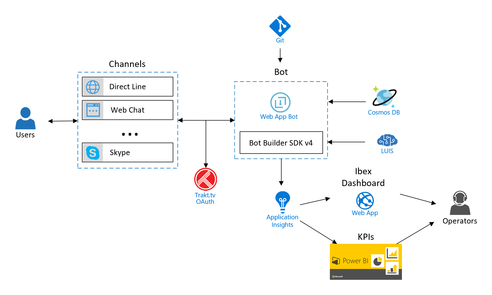

This sample demonstrates a bot to interact with [Trakt.tv](https://trakt.tv/) services. 
It has been developed with [ASP.NET Core 2](https://docs.microsoft.com/en-us/aspnet/core/?view=aspnetcore-2.0) & [Azure Bot Service v4](https://docs.microsoft.com/en-us/azure/bot-service/?view=azure-bot-service-4.0). [Alejacma.Bot library](https://github.com/magencio/TraktBotCSharp_V4/tree/master/Alejacma.Bot) contains helper classes that simplify the development of bots with [Bot Builder SDK v4](https://github.com/Microsoft/botbuilder-dotnet/tree/master/libraries).

## Architecture

## Documentation, SDKs and Tools
- [ASP.NET Core 2](https://docs.microsoft.com/en-us/aspnet/core/?view=aspnetcore-2.0)
- [Azure Bot Service v4](https://docs.microsoft.com/en-us/azure/bot-service/?view=azure-bot-service-4.0)
- [.NET version of the Bot Builder SDK v4](https://github.com/Microsoft/botbuilder-dotnet/tree/master/libraries)
- [.NET Core samples of the Bot Builder SDK v4](https://github.com/Microsoft/BotBuilder-Samples/tree/master/samples/csharp_dotnetcore)
- [Bot Builder tools](https://github.com/Microsoft/botbuilder-tools)
- [Microsoft Bot Framework Emulator](https://github.com/microsoft/botframework-emulator)
- [IBEX Dashboard](https://github.com/Azure/ibex-dashboard)

## Additional information
- [Using LUIS for Language Understanding](https://docs.microsoft.com/en-us/azure/bot-service/bot-builder-howto-v4-luis?view=azure-bot-service-4.0&tabs=cs)
- [LUIS with AppInsights sample](https://github.com/Microsoft/BotBuilder-Samples/tree/master/samples/csharp_dotnetcore/21.luis-with-appinsights)
- [Persist user data with CosmosDB](https://docs.microsoft.com/en-us/azure/bot-service/bot-builder-tutorial-persist-user-inputs?view=azure-bot-service-4.0&tabs=csharp)
- [Add authentication to your bot via Azure Bot Service](https://docs.microsoft.com/en-us/azure/bot-service/bot-builder-authentication?view=azure-bot-service-4.0&tabs=csharp)
- [Download and redeploy bot code](https://docs.microsoft.com/en-us/azure/bot-service/bot-service-build-download-source-code?view=azure-bot-service-4.0)
- [Create and manage connected services in your bot configuration file](https://github.com/Microsoft/botbuilder-tools/tree/master/packages/MSBot)
- [Testing and debugging guidelines](https://docs.microsoft.com/en-us/azure/bot-service/bot-builder-testing-debugging?view=azure-bot-service-4.0)

### Authentication settings
OAuth Connection Settings for TraktTv in Azure Bot Service:
- Name: TraktTv
- Service Provider: Generic Oauth 2
- Client id: << your trakt.tv client id>>
- Client secret: << your trakt.tv client secret>>
- Authorization URL: https://api.trakt.tv/oauth/authorize
- Token URL: https://api.trakt.tv/oauth/token
- Refresh URL: https://api.trakt.tv/oauth/token

## TO DO
- Track sentiment of messages in App Insights.
- Add more testing.
